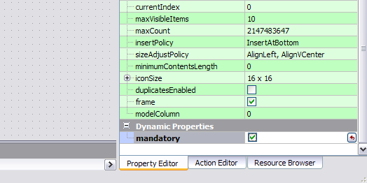

====================
|name| - README
====================

:Authors:
    Nathan Woodrow,
    Damien Smith

:Version: 1.0

.. |name| replace:: QMap
.. |f| image:: images/folder.png

.. contents::
.. sectnum::

The |name| is a simple to use, simple to configure, data collection
program built by Southern Downs Regional Council that uses QGIS.  |name| is a QGIS
Python plugin that removes most of the interface and replacing it with a simple
to use interface for data collection.

As |name| is just a Python plugin you can use your normal QGIS project files (.qgs)
in order to create mapping projects.

Zen
---

- Don't reinvent the wheel -- unless for good reason.
- Magic is cool.
- Although not cool enough if it makes things confusing.
- Datebases are handy things.
- Although plain text files are normally easier to manage.
- Convention over Configuration is cool idea -- lets do more of that!
- Unless it starts to look like magic.

Requirements
-------------
- Latest QGIS Version > 1.8
- nose and mock (for Python tests)
- MS SQL Server 2008 (express or greater)
- .NET 3.5 (or greater)
- Microsoft Sync Framework
- Qt Designer (for form building)
- Something to install it on (some kind of fancy tablet PC)

Building
----------

For building we use fabricate_, a build tool written in pure Python,
because frankly GNUMake is a pain to use, the syntax is just plain strange,
and it sucks at error reporting.

.. _fabricate: http://code.google.com/p/fabricate/

To build just run **make_win.bat** from the main root folder.  build.py will generate
all the needed files and deploy them into the build directory.

The QGIS plugin location is |f| ``/QMap/app/python/plugins``

You can run build.py using Python with other arguments:

.. code-block:: console

    #Clean build files
    python build.py clean

    #Build only docs
    python build.py docs

    #Build only
    python build.py build

The version number used is {year}.{month}.{day}.{commitid} and inserted into
metadata.txt.  The version in metadata.txt is the version number for all the
files and related binaries in the project; ignore all other version numbers.

Installing
----------

.. note:: If you haven't done so already please read Building_

Install the following software onto the client

    - MS SQL Server 2008
    - .NET 3.5
    - Microsoft Sync Framework
    - QGIS (Lastest version)

Running the build.py file will compile and deploy the plugin to the list of
clients.

.. code-block:: console

    python build.py

A list of targets that will be deployed can be found in targets.ini. An example
of a target is:

.. code-block:: console

    [Touch]
    client : \\computername\path\to\desktop
    projects : All
    forms : All
    

.. note:: The build script will run the unit tests.  If any tests fail the
          build script will error and exit.  This is to prevent deploying a
          version that breaks already working code.

Conventions
-----------

|name| follows a convention over configuration style in order to
make setup consistant and easy. At times we may need to configure things
but this will be kept to a minimum.

Form Conventions
++++++++++++++++

- Layer field names map to object names in Qt form (.ui)

  The form binder searchs the form for a widget named the same as the field and
  will bind and unbind the value from the layer to the form.  The widget type
  defines how the object is bound e.g. a column named *MyColumn* will bind
  to the QLineEdit::text() property of the widget with the same name.

  .. warning:: There is very little error handling with the form binding.
               Binding a char column with the value "Hello World" to a QCheckBox
               might do strange things.

- Date and time pickers can be created by placing a button on the form with
  the same name as the DateTimeEdit control but with the *_pick* added to the names
  end.

  .. figure:: images/DateTimePickerExample.png

     Layout of QDateTimeEdit and QPushButton

  .. figure:: images/DateTimePickerExampleLayout.png

  Note the name of the QDateTimeEdit and the QPushButton.
  The QPushButton can live anywhere on the form, the only constraint is that it
  uses the {name}_pick convention.

  A correctly bound date time picker button has the word "Pick" and an icon.

  .. figure:: images/DateTimePickerBound.png

     Result of correct binding

- To correctly create a drawing pad button binding do the following:
    - Create a field in the datebase
    - Name a QPushButton with the field name - following the "fieldnames = object name"
      convention.
    - Label the button with "Drawing"

  .. figure:: images/DrawingBound.png

     Result of correct drawing button binding

  .. note:: The image is stored on the filesystem not in the layer. So no value is
           ever stored in the database. See `Program Conventions`_ for details on
           image convention.

- Adding a map picker button.  A tool that can be used to select a feature from
  the map can be added by adding a QToolButton to the form with the object name
  as {name}_mapselect where {name} is the name of the control the result will be
  bound to.

  .. figure:: images/MapSelectBound.png

     Control with QToolButton with the same name.

  In the above example the result of the map select will bind the result to the
  LotPlan control which is a QLineEdit.

  Two custom properties also need to be added to the buttom in order to define
  where the picked value comes from.

  The two properties are *from_layer* and *using_column*.

  .. figure:: images/MapSelectProperties.png

     Custom properties on QToolButton

  If any of the above properties are missing, or the layer supplied is not found,
  the map select button will be disabled.

  Adding custom properties will be explained in `Creating a new entry form`_

- Adding mandatroy fields. Fields that are mandatory will be highlighted, and
  if not filled in, will stop the user from leaving the form.

  To include a control as mandatory just add a "mandatory" bool custom property
  to the control that should be mandatory.

  .. figure:: images/MandatroyProperties.png

     Custom property to set mandatory flag.

  In order for the program to correctly handle highlighting the field as mandatory
  you also have to name the label for the control with {name}_label.  When the
  edit control is marked as mandatory its label will be highlighted.

  .. figure:: MandatoryLabelExample.png

  Adding custom properties will be explained in `Creating a new entry form`_

Form Conventions Summary
!!!!!!!!!!!!!!!!!!!!!!!!!

  - {control name} is {field name}
            Maps field value to control.

  - {control name}_label (Only QLabel)
            Pairs label with control (for Mandatroy highlighting)

  - {control name}_pick (Only QPushButton)
            Open date and time picker and bind result value to the control with
            the name {control name}

  - {control name}_mapselect (Only QToolButton)
            Binds the result of a map select to the control
            with the name {control name}

Program Conventions
+++++++++++++++++++

- Images saved from drawing pad are stored in |f| ``data/{layername}/images``.
  Images have the following naming convention:

        {id}_{fieldname}.jpg

  Example:

        D896C1C0-9E4B-11E1-AB3F-002564CC69E0_Drawing.jpg

  Temp images that are saved before commit have the following convention and are
  saved in the user temp directory:

        drawingFor_{fieldname}.jpg

  *drawingFor\_* is replaced with *{id}* when the record is commited into the layer.
  The image is then moved into the |f| ``data/{layer name}/images`` folder
  where ``{layer name}`` is the name of the layer for the form.

- Projects are stored in the |f| ``projects/`` directory.  The name of the .qgs file will
  be used in the open project dialog box.  The project directory is **not** recursive

SQL Table Conventions
+++++++++++++++++++++
In order for MS SQL syncing to be correctly used the table must contain the following
columns:

    UniqueID as uniqueidentifier

    Primary Key column **must** be Int

Tables must also be provisioned for syncing using the provision tool before syncing
will work.  More information can be found in `Client Setup`_

.. _Client Setup: ClientSetup.html

Creating a new entry form
--------------------------

Creating a new form involves five items:

     - A folder that holds the form (must start will 'form' e.g. formMyWaterForm)
     - A form.ui file (The UI that is shown to the user)
     - A settings.ini file
     - __init__.py empty text file that is used to import the form.
     - icon.png (optional toolbar icon)

A sample form, and files, can be found in |f| ``entry_forms/_formSample``

Save as template (once only)
++++++++++++++++++++++++++++

Open Qt Designer and open the template form called template_motionf5v.ui stored in
entry_forms/.
Select ``File -> Save as Template...`` and save it as Motion F5V

Making a new entry form
++++++++++++++++++++++++

Given a layer in QGIS which will need a custom form:

.. figure:: images/DataTable.png

We are going to do the following in order to create a custom form:

    - Create the __init__.py file
    - Create a settings.ini file
    - Create a new form in Qt Desinger and;
    - Add a read only box for assetid
    - Add a mandatory dropdown box for fittingtype
    - Add a mandatory dropdown box for diameter
    - Add a date time picker for dateinstalled
    - Add a checkbox for replacedexisting

Create a new folder in |f| ``entry_forms\`` called |f| ``formWaterFittings``

.. note:: |name| uses a convention for detecting user forms and their folders.
          The folder must start with the word *form*.

Inside |f| ``formWaterFittings`` folder create a empty text file called __init__.py and
settings.ini, and copy the icon.png from the _fromSample folder.

Copy the following information into settings.ini

.. code-block:: console

   form_name = Add water fitting
   layer_name = WaterFittings
   fullscreen=False

*form_name* is the name shown on the toolbar when adding a new map object;
*layer_name* is the name of the layer the form is associated with, one layer can
have many forms. Set *fullscreen* to True if you want the form to be shown in
full screen mode.

The file structure should look like the following so far:

.. figure:: images/folderlayout.png

The form.ui file will be created in the next step.

Select ``File -> New..`` and select Motion F5V from the user forms section

.. figure:: images/Template.png

Select ``File -> Save`` and save it with the name **form.ui** into the new
|f| ``formWaterFittings`` folder.

First drag and QLabel and QLineEdit onto the form for assetid and set the objectName
property for the label to 'assetid_label' and the text property to something
like "Asset ID".  Set the objectName property of the QLineEdit to just 'assetid'
and set the readonly to True.

.. figure:: images/assetid.png

Create a label and groupbox control for fittingtype and diameter. Name and label
them both following the naming rules.

Right click, or press F2, on the fittingtype combobox and select Edit Items....
Fill in the list with values that will be used on the form. Always leave an
empty entry at the top to allow the binder to handle an empty value selection.

.. figure:: images/FittingTypesCombo.png

Do the same for diameter

.. figure:: images/DiameterCombo.png

As fittingtype and diameter are mandatory we are going to add a custom property
to both in order to say that they are.  Hold Ctrl and select both the fittingtype
and diameter combo box. Click on the green plus button the Property Edit panel and
changing the Property Name to "mandatory" and the Property Type to Bool

.. figure:: images/MandatroyProperty.png

Scoll to the bottom of the properties list and enable the mandatory flag

Adding the mandatory flag on the combo box will highlight the label that is assigned
to the control using the {control name}_label convention.

Next we will add a QLabel, QDateTimeEdit, QPushButton, in order to add a date time
picker. Name the QDateTimeEdit as dateinstalled, the QLabel as dateinstalled_label,
and the QPushButton as dateinstalled_pick

Hold ctrl and select all three controls

.. figure:: images/DateSelected.png

and select the Horizonal Layout button on the toolbar.  The controls will
be aligned and grouped together.  The red box highlights the controls as inside
the one layout. 

.. figure:: images/HorizonalLayout.png

Ignore the text on the QPushButton as it will be replaced with a icon and the text Pick
when the program runs.

Add a checkbox control onto the form changing its name to replacedexisting.

**Important step**

The last step is to add a QButtonBox that has a OK and Cancel button.

.. warning:: |name| expects there to be a QButtonBox on the form with the name
          ``buttonbox``. The form will not work correctly and you will get errors
          if the button box is missing.

The form is also too big just for a few controls so resize it to a acceptable size.
Select the main root item in the Object Inspector pannel and click grid layout.

.. figure:: images/GridForm.png

Clicking the grid layout will auto size all the controls to fit the remaining
space in the form.  Depending on the needs of form this may or may not be a good
idea.

.. figure:: images/GridFormLayout.png

Save the form.

Adding a project
-----------------------
Projects are stored as QGIS project files and live in the |f| ``projects/`` folder. When
the application is run the |f| ``projects/`` folder is scanned for .qgs files and they
are loading into the list of projects.  **Only** the top level is scanned.

Adding a new project is simple.

    - Create a new project in QGIS
    - Add the layers that you need
    - Save the project (.qgs) file into the |f| ``project/`` folder

Entry Forms are matched on layer names, not file names, so if you can have a file
called myWaterFittings.shp in order for |name| to match the form to the layer we can
just name it in QGIS as WaterFittings wihtout changing the file name

.. figure:: images/NamingLayer.png
