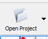
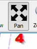
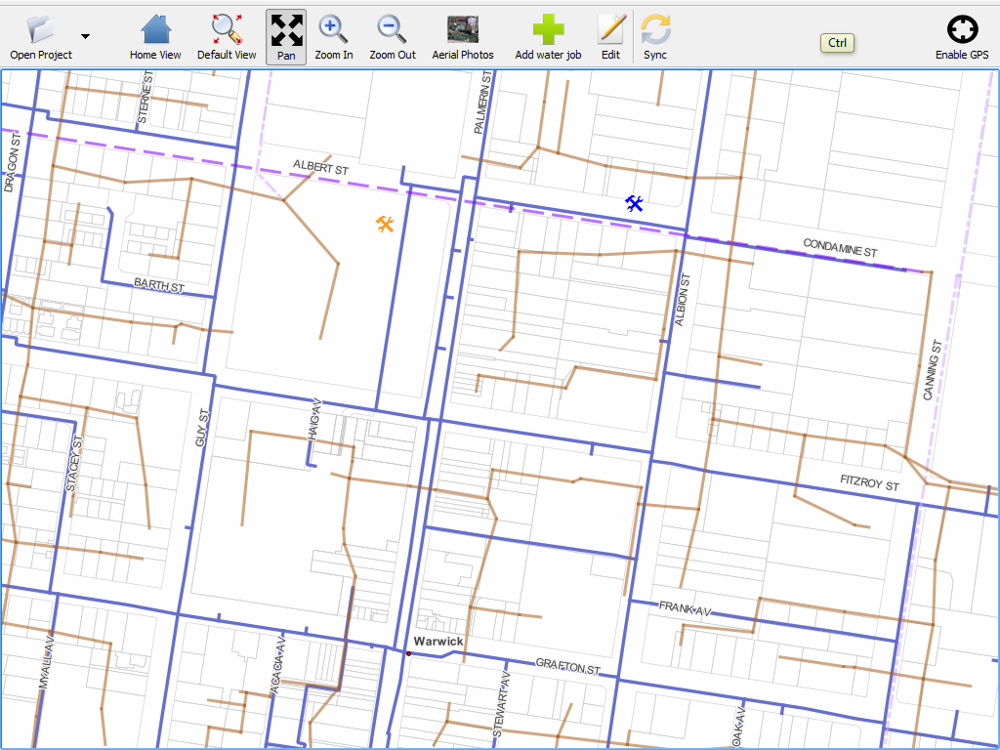
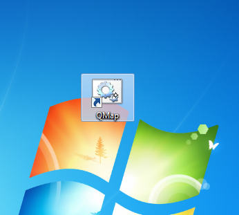

.. |name| replace:: QMap

===================
|name| User Guide
===================

:Authors: Nathan Woodrow
:Last updated: 2012-10-24

.. contents::
.. sectnum::

.. |projectselect| image:: user_images/projectselection.png
	:height: 768
	:width: 1024
	:scale: 60 %

.. |loadingproject| image:: user_images/loadingproject.png

Loading |name| and projects
----------------------------

Lauch |name| using the icon on the desktop

	|start|

Once |name| loads you will be presented with a list of projects to pick from

	|projectselect|

Select a project to load by single clicking the name in the list

	|loadingproject|

	.. note:: Some projects can take a little while to load.

Once a project is loaded the map will be displayed

	|loaded|

|name| interface layout
-----------------------

	.. figure:: user_images/uilayout.png
		:height: 768
		:width: 1024
		:scale: 80 %

The actions of each markered item is:

	1. **Open Project** Switches the currently open project.
	2. **Home View** Zooms to the map to show the layers.
	3. **Default View** Zooms and pans to the map to the location the project was open at.
	4. **Pan** Enable the pan tool.;
	5. **Zoom In** Enable the zoom in tool.
	6. **Zoom Out** Enable the zoom out tool.
	7. **Aerial Photos** Show or hide the aerial photos.
	8. **Add water job** Add a new water job (*note*: a project may contain more then one add button each with its own name)
	9. **Edit** Enable edit mode in order to edit an existing record.
	10. **Sync** Sync the local tablet data with the server.
	11. **GPS button** Enable or disable the GPS.
	12. **Map area** The main map area.

Preforming actions
-------------------

Panning and Zooming
+++++++++++++++++++

To pan the map:

	1. Select the **Pan** tool
	2. Click and drag the map to pan

		..  image:: user_images/panaction.png
			:height: 768
			:width: 1024
			:scale: 60 %

To zoom in or zoom out:

	1. Select the **Zoom In** or **Zoom Out** tool
	2. Single click to zoom in/out one step

		or

	3. Click and drag a box to zoom in/out on the area

		..  image:: user_images/zoomaction.png
			:height: 768
			:width: 1024
			:scale: 60 %

Enabling Aerial Photos
++++++++++++++++++++++

To enable photos:

	1. Click the **Aerial Photos** button
	2. Photos will be visible

		..  image:: user_images/photosaction.png
			:height: 768
			:width: 1024
			:scale: 60 %

	3. Click the **Aerial Photos** button again to disable 

Adding a new job
++++++++++++++++

To add a new job:

	1. Select the **Add water job** button

		..  image:: user_images/addwaterjob.png

	2. Single click on the map at the location you which to add n new job.

		..  image:: user_images/addpoint.png
			:height: 768
			:width: 1024
			:scale: 60 %

	3. The details form will open

		..  image:: user_images/dataform.png
			:height: 768
			:width: 1024
			:scale: 60 %

	4. Fill in the details and press OK.
	5. A new point will be added to the map

		..  image:: user_images/addresult.png
			:height: 768
			:width: 1024
			:scale: 60 %

	.. note:: Yellow highlighted fields must be completed before you can OK the form. Green means the field has been completed.
		Trying to OK the form with yellow fields remaining will result in:

		..  image:: user_images/yellow.png
			:height: 768
			:width: 1024
			:scale: 60 %

Picking a date
!!!!!!!!!!!!!!!

To pick a date using the date picker:

	1. Select the **Pick** button next to the field

		..  image:: user_images/formwithdate.png

	2. The date picker will open

		..  image:: user_images/datapicker.png
			:height: 768
			:width: 1024
			:scale: 60 %

	3. Select **Set as current data and time** to set the date and time to today.
	4. Change any other values as needed.
	5. Press OK

Picking the request property (aka using the map select tool)
!!!!!!!!!!!!!!!!!!!!!!!!!!!!!!!!!!!!!!!!!!!!!!!!!!!!!!!!!!!!

.. |mapselect| image:: user_images/mapselect.png

The map select tool |mapselect| can be used to select other features on the map in order to pull informatiom from them.  In the case of the water jobs form it will be used for selecting the property that requested the job (if any)

To pick a property:

	1.  Click the map select tool next to a field

		..  image:: user_images/mapselectform.png

	2. The map will reopen and the cursor will change to green.
	3. The property that to be selected will be highlighed blue when hovering over with the pen

		..  image:: user_images/mapselectmap.png
			:height: 768
			:width: 1024
			:scale: 60 %

	4. Single click to select the property
	5. The lot and plan of the property will be extracted and placed in the field

		..  image:: user_images/mapselectresult.png

Remember value button
!!!!!!!!!!!!!!!!!!!!!

The remember value button can be used to remember value between each form open. Selecting a value in the field next to the button and pressing the button down will make |name| remember that value the next time the form is open.

		..  image:: user_images/remember.png

The button will remain pressed down and remembering the value until unpressed.

GPS
+++

To enable the GPS:

	1. Press the **GPS button** on the toolbar

		..  image:: user_images/GPS.png

	2. Until the GPS gets a position from the satellites it will display `No Fix`

		..  image:: user_images/nofix.png

	3. Once the GPS has a position the icon will change to green and display `GPS Fixed`.  The map will also recenter onto the GPS location.

Switching Projects
++++++++++++++++++

To switch a project:

	1. Select the **Open Project** button 
	2. The project list will be shown

	   |projectselect|

	3. Single click to load a project
	4. Project will be loaded into QMap

	   |loaded|

 