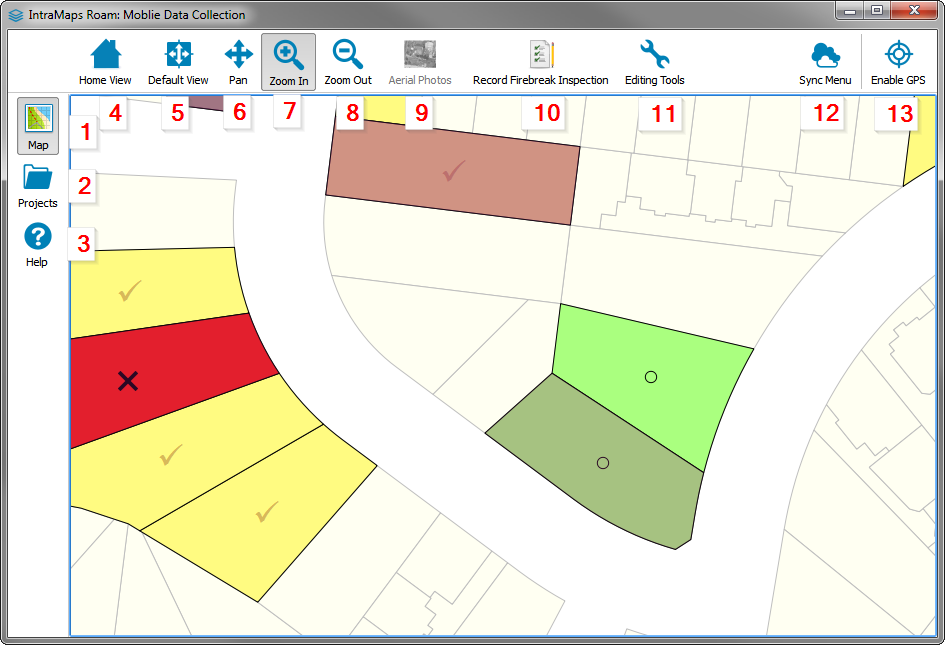
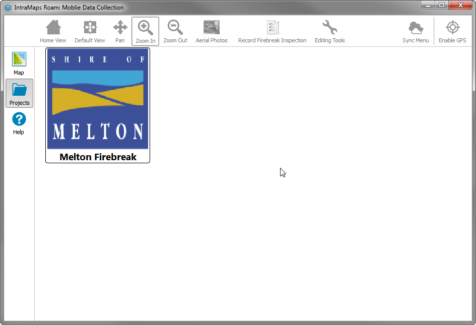
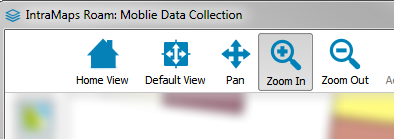
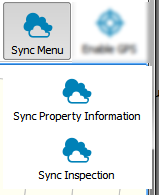
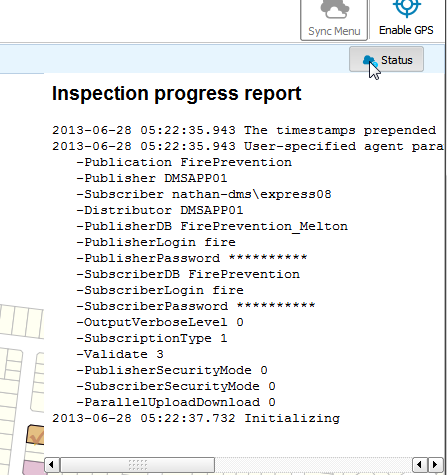

=================================
|name| Quickstart
=================================

Interface overview
===================

Each item in the UI is as follows:

1. Map View
2. Project Selection
3. Help panel
4. Home View (Full extents)
5. Default View (Project start view)
6. Pan
7. Zoom In
8. Zoom Out
9. Aerial Photos
10. Data entry tool
11. Edit Tools menu
12. Sync Menu
13. Enable GPS

The functions of each of these tools will be covered in the sections below.

Project Selection
=================

When first lauched |name| will present a project selection screen in order to select the project to load.
|name| can contain more then a single project and if installed they will be listed here.

.. _projectloading:

Loading a project
++++++++++++++++++++

.. note:: Depending on which layers the project contains it can sometimes take a second or so to load.

1. Select :guilabel:`Projects` |btnProjects| on the side panel.
2. Single click on the tile for the project.
3. The project will be loaded into the map view

Map View
===================

After a |name| project is loaded it will be opened in the map view.  You can switch projects at anytime by following :ref:`projectloading`

Navigating the map
+++++++++++++++++++

|name| provides the standard tools to allow for map navigation.

* **Home View** - Zoom the map view to the full extants of the map
* **Default View** - Reset the view that the project loaded with
* **Pan** - Pan the map by dragging.
* **Zoom In** - Click to zoom in, *or* Drag a rectangle to zoom to that extent.
* **Zoom Out** - Click to zoom out

.. note:: |name| also provides touch panning and Pinch-To-Zoom while the :guilabel:`Pan` tools is selected

Enable/Disable Aerial Photos
+++++++++++++++++++++++++++++

If the project contains aerial photos that can be enabled or disabled by clicking the :guilabel:`Aerial Photos` |btnAerialPhotos| button.  

Editing attribute values
+++++++++++++++++++++++++

Editing attributes is only supported on configured layers.  These layers will be configured by the |name| admin.

1. Select the :guilabel:`Edit Tools` |btnEditTools| menu. 
2. A pop out menu will be presented

 |btnEditMenu|

3. :guilabel:`Edit Attributes` |btnEditAttributes| will be selected by default
4. Hover over the feature on the map for editing.  The feature will be highlighted in orange.

	.. image:: ../_static/editselect.png
	
5. Single click the feature.

If more the one feature is under the click point you will be presented with a feature selection screen.
	
	.. image:: ../_static/editlist.png

5a. Select the feature to edit from the list.
6. The edit form will open

.. important:: All actions in |name| auto save the feature after they are completed.

Moving Features
++++++++++++++++++++++++

Editing attributes is only supported on configured layers.  These layers will be configured by the |name| admin.

1. Select the :guilabel:`Edit Tools` |btnEditTools| menu.
2. A pop out menu will be presented

 |btnEditMenu|

3. Select :guilabel:`Move Feature` |btnMoveFeature|.
4. Click and drag the feature on the map
5. Release to finsihed the move.

.. important:: All actions in |name| auto save the feature after they are completed.

.. _syncing:

Syncing Data Changes
++++++++++++++++++++++++

Each project can be configured with its own syncing options.  
The syncing menu will different based on the current project that is loading.

If the project has more then one sync option these will be presented in the
:guilabel:`Sync Menu` as menu options.

If the project only has a single option the :guilabel:`Sync` button will revert to a single button that
will start the sync process.

A sync progress report can also be viewed by clicking the :guilabel:`Status` button

Enable/Disable GPS
++++++++++++++++++++

**To Enable**

1. Select the :guilabel:`Enable GPS` |btnGPSEnable| button.
2. The GPS will be enabled and a marker shown on the map

.. note:: 
	
	The map view will keep the GPS in view at all times.  
	The map will automatically pan when the GPS moves out of view.  
	If you would like to stop this just disable the GPS.

**To Disable**

1. Select the :guilabel:`Disable GPS` |btnGPSDisable| button.

