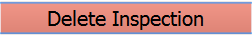
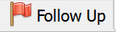
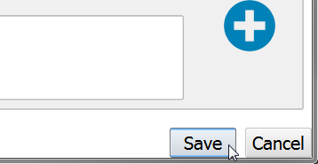
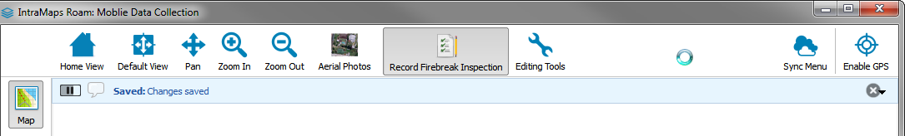
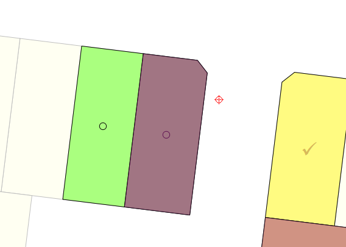
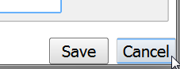
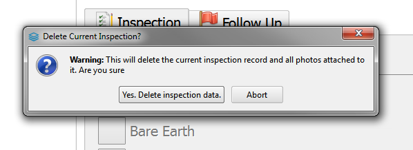
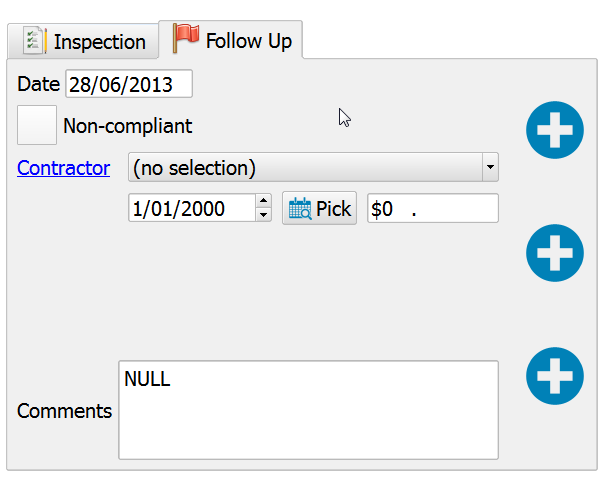
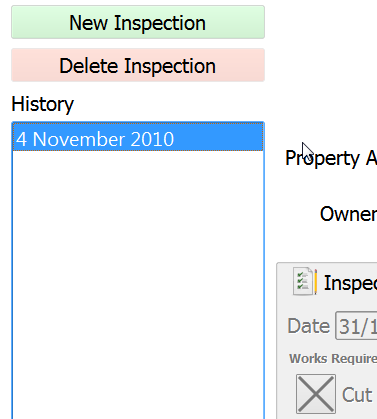

====================================
Melton |name| Firebreak User Guide
====================================

.. |btnNewInspection| image::  ../_static/melton_btnNewInspection.png

Introduction
============

If you haven't done so first read though :doc:`firsttime` as it will give you an overview of the application 
and how to navigate interface 

Loading the Melton Project
==========================

1. Select :guilabel:`Projects` |btnProjects| on the side panel.
2. Single click on the **Melton Firebreak** project.

	.. image:: ../_static/melton_projectselect.png
	
3. The project will be loaded into the map view

Conducting Inspections
============================

Undertaking a New Inspection
++++++++++++++++++++++++++++++

1. Select :guilabel:`Record Firebreak Inspection` from the top menu

	.. image:: ../_static/btnMeltonInspection.png
	
2. Click a new property without an inspection
3. The selected property will be highlighted in red

	.. image:: ../_static/melton_highlightedproperty.png
	
4. The inspection form will open

	.. image:: ../_static/melton_inspectionform.png
		:scale: 50%

.. _propertyselect:	

Undertaking a revist Inspection
+++++++++++++++++++++++++++++++

If selected property already contains an active inspection the details for the inspection will be opened.

1. Select :guilabel:`Record Firebreak Inspection` from the top menu

	.. image:: ../_static/btnMeltonInspection.png
	
2. Click a property with an existing inspection
3. The selected property will be highlighted in red

	.. image:: ../_static/melton_highlightedproperty.png
	
4. The inspection form will open

	.. image:: ../_static/melton_inspectionformexisting.png

If you wish to create a new inspection for the selected property.  

1. Click the :guilabel:`New Inspection` |btnNewInspection| button.

	.. image:: ../_static/melton_btnNewInspectionSection.png

Clicking the :guilabel:`New Inspection` button will archive the exsiting record and reopen an empty form.
	
.. note:: The :guilabel:`New Inspection` button will be disabled for a property without an existing inspection.
	
Property Deatails
+++++++++++++++++++++++++++

When a new inspection is created, the property details section of the inspection form will be populated with information from 
the property and rating system.

.. image:: ../_static/melton_propertydetails.png

In the case of strata properties, or properties with multi assessments attached, when selecting a property for a new inspection
a property selection list will appear allowing you to select the correct property.

.. image:: ../_static/melton_propertyselect.png

Single click the property in the list to create an inspection for that property.

Inspection Details Section
+++++++++++++++++++++++++++++

The inspection detauls can be filled out in the lower half of the form.

.. image:: ../_static/melton_inspectiondetails.png

For new inspections, the ID is not populated until the new inspection is saved. A placeholder, <new>, is 
inserted in its place to indicate that this is, indeed, a new record.  The date is automatically populated with
the current date.

Works required
~~~~~~~~~~~~~~~~~~~~~~~~~~~

The fire prevention requirements to be performed for the inspection can be selected by clicking in the check 
boxes under the work required. The options are:

*  Cut all grass 
*  Bare Earth 
*  Slash Break 

Any combination of the options for the required works can be selected.  For the Bare Earth and Slash Break 
selections a distance is to be added into the Distance text box. The default is 3m.

The works compliance date will be populated with the date + 16 days from the current date. The user has the 
ability to override this by selecting the |btnPick| pick calendar icon next to the field and choosing the date from the date 
selector. 

.. image:: ../_static/melton_works.png

Comments
~~~~~~~~~~~~~~~~~~~~~~~~

Comments can be entered in the comments box at the bottom of the form.

.. _attachphotos:

Attaching Photos
~~~~~~~~~~~~~~~~~~~~~~~~~

Each inspection can have up to three (3) photographs assigned to it.

**To add a photo**:

1. Select the Add Photo |btnAddPhoto| button
2. Select the image in the Windows File picker
3. The image will be added

	.. image:: ../_static/melton_image1.png
	
**To replace a photo**:

1. Hover over the image

	.. image:: ../_static/melton_photohover.png
	
2. The |btnReplacePhoto| and |btnDeletePhoto| buttons will be shown.
3. Select |btnReplacePhoto|
4. Select the image in the Windows File picker
5. The image will be added

	.. image:: ../_static/melton_image2.png

**To view a larger photo**:

1. Click an image button with an active image.
2. A larger version will open

	.. image:: ../_static/melton_image3.png
	
3. Close by clicking anywhere on the larger image

**To remove a photo**:

1. Hover over the image

	.. image:: ../_static/melton_photohover.png
	
2. The |btnReplacePhoto| and |btnDeletePhoto| buttons will be shown.
3. Select |btnDeletePhoto|
4. The image will be removed

	|btnAddPhoto|
	
Saving Inspections
~~~~~~~~~~~~~~~~~~

Simply click the :guilabel:`Save` button at the bottom of the form to save the inspection data.

The inspection data will be saved and the map will be updated to reflect the state of the property under inspection.

Cancelling Inspection
~~~~~~~~~~~~~~~~~~~~~~~

If you which to cancel the data entry done on an inspection. Simple click the :guilabel:`Cancel` button
at the bottom of the form.

Deleting Inspection Data
~~~~~~~~~~~~~~~~~~~~~~~~~

The active inpsection data can be deleted using the :guilabel:`Delete Inspection` |btnDeleteInspection| buttton.  A warning will be 
presented before any data is deleted

Conducting Follow up Inspections
=================================

A follow-up inspection may need to be completed to ensure properties are compliant.  This can be done selecting the :guilabel:`Follow Up` |btnFollowUp| 
tab and filling in the relivent information when an inspection form is open.

1. Select a property as outlined in :ref:`propertyselect`
2. Select the :guilabel:`Follow Up` |btnFollowUp| tab
3. Click the :guilabel:`Add Follow Up` button to add follow up information to an inspection

If the property is still non-compliant at the follow up inspection, this can be flagged by checking the box.  For 
these properties, a contractor can be chosen from the drop down list of approved contractors and a date 
chosen from the date picker.

Any comments can be added to the ‘Comments’ box. 

Photos can be also be added in the same manner as for the initial inspection. See :ref:`attachphotos`

Viewing Inspection History
=================================

Properties that have had multiple inspections over time will show a single record for each inspection in the history panel on the side
of the inspection form.

1. Single click on a item in the list to view the history

	.. image:: ../_static/melton_historyview.png
	
.. note:: Images can be viewed in a larger viewer by clicking the image in the report.

Syncing Data Changes
=================================

.. seealso:: :ref:`syncing` for a general overview of the syncing process.

Data Transfer must be completed both at night **after** performing the inspections and again in the morning
**before** going out into the field.

If errors are encountered, please contact your System Administrator

.. important:: 
	
	Please ensure you are connected to the **office network**.  This is important so that a connection
	to the master database server can be established
	
Synchronising Inspections Only
+++++++++++++++++++++++++++++++

1. Select :guilabel:`Sync Inspections` from the :guilabel:`Sync Menu`. This will run a background operation which automatically uploads all inspection data you have created into the master database.
2. Syncing progress will be shown in a message bar above the map
	
	.. image:: ../_static/syncinprogress.png

3. The message bar will report success once the sync is complete.

	.. image:: ../_static/synccomplete.png

Synchronising Property and Owner Data
++++++++++++++++++++++++++++++++++++++

If you want to refresh the property and owner information.

1. Select the :guilabel:`Sync Property Information` menu option.
2. Syncing progress will be shown in a message bar above the map
	
	.. image:: ../_static/syncinprogress.png

3. The message bar will report success once the sync is complete.

	.. image:: ../_static/synccomplete.png